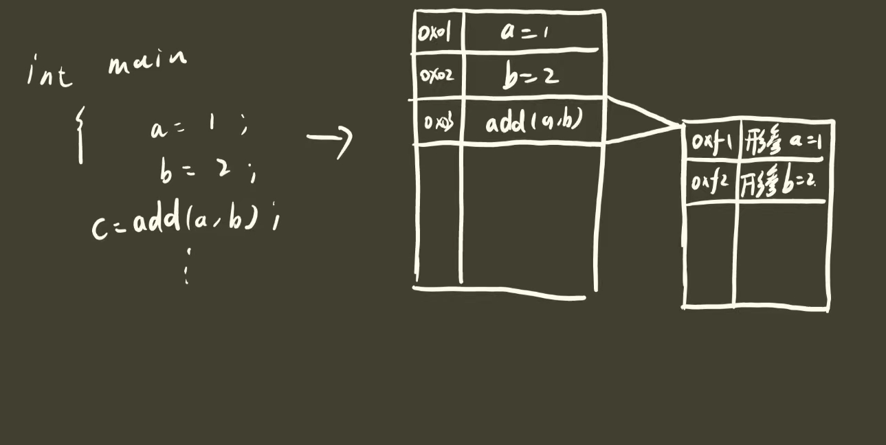
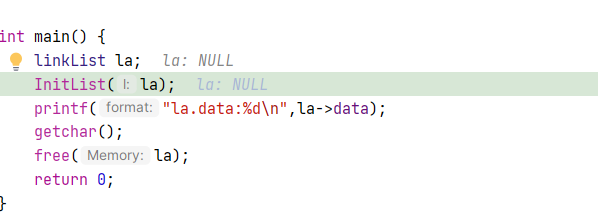
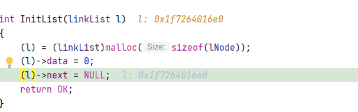
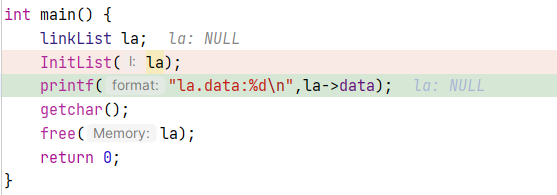

# LinearList

## 1.创建链表

我们首先定义一个基本的链表结构体，内部包含**数据元素**和**指向下一个节点的指针**

```c
typedef struct lNode
{
    int data;
    struct lNode  *next;
}lNode, *linkList;
```

我们用linkList作为头结点的指针，当我们想创建一个链表的时候，实际上就是将头结点指针指向我们自己开辟的一块内存空间。我们只要完成了这一步，就代表我们基本的链表创建完成了。

```c
int InitList(linkList *l)
{
    (*l) = (linkList)malloc(sizeof(lNode));
    (*l)->data = 0;
    (*l)->next = NULL;
    return OK;
}
```

我们通过InitList函数，开辟了一段内存空间当做头结点，然后将头结点指针指向了我们开辟的头结点，这样我们就完成了链表的初始化。


这里可能有人会有疑问，就是为什么传入的参数是 **linkList *l** 也就是指针的指针，双指针。这个地方涉及到函数运行的原理。函数运行的基本原理是，我们向函数中传入一个形参，C语言首先会为我们传入的形参开辟一片另外的内存。



通过程序我们也可以验证，传入linkList l。**通过Debug我们知道传入之前我们的la指向为空**



在函数内部我们看到l指向了我们开辟的一段地址空间。



但是当我们退出的时候，我们会发现la并没有指向这个地址，而是仍然指向NULL。



