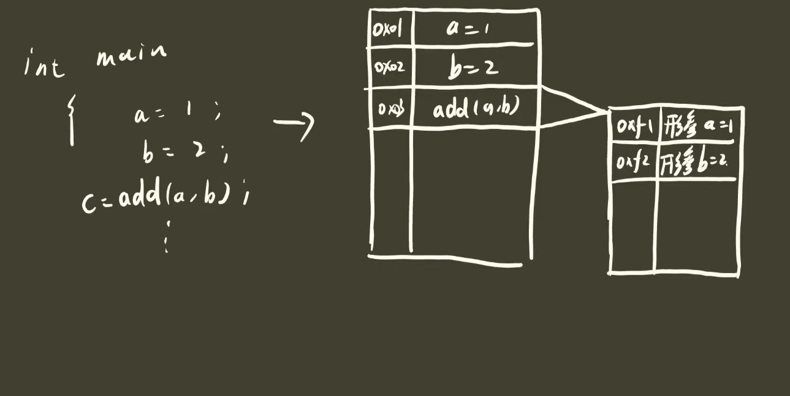

# `LinearList`

## 1.初始化链表

我们首先定义一个基本的链表结构体，内部包含**数据元素**和**指向下一个节点的指针**

```c
typedef struct lNode
{
    int data;
    struct lNode  *next;
}lNode, *linkList;
```

我们用`LinkList`作为头结点的指针，当我们想创建一个链表的时候，实际上就是将头结点指针指向我们自己开辟的一块内存空间。我们只要完成了这一步，就代表我们基本的链表创建完成了。

```c
int InitList(linkList *l)
{
    (*l) = (linkList)malloc(sizeof(lNode));
    (*l)->data = 0;
    (*l)->next = NULL;
    return OK;
}
```

我们通过`InitList`函数，开辟了一段内存空间当做头结点，然后将头结点指针指向了我们开辟的头结点，这样我们就完成了链表的初始化。


这里可能有人会有疑问，就是为什么传入的参数是 **`linkList *l`** 也就是指针的指针，双指针。这个地方涉及到函数运行的原理。函数运行的基本原理是，我们向函数中传入一个形参，C语言首先会为我们传入的形参开辟一片另外的内存。



通过程序我们也可以验证，传入`linkList l`。**通过Debug我们知道传入之前我们的la指向为空**


在函数内部我们看到l指向了我们开辟的一段地址空间。


但是当我们退出的时候，我们会发现la并没有指向这个地址，而是仍然指向**NULL**。


>**以下都是对链表的基本操作，采用画图的形式进行表达，自我感觉画图是表达链表最清晰直观的方式，所以此处不再贴出具体代码，具体代码请移步Code文件夹查看**

## 2.创建链表


## 3.销毁链表


## 4.返回前驱结点


>**其余操作不在这里列出，思路基本大同小异，比较简单**
